# Data Visualization in Python

## Matplotlib

### Definition

Matplotlib is a powerful and widely used data visualization library in Python.

### Purpose

It allows you to create static, animated, and interactive plots such as line graphs, bar charts, histograms, scatter plots, pie charts, and more.

### Main Module

The most common module used is `matplotlib.pyplot`, which provides functions similar to MATLAB for quick plotting.

### Advantages

- Highly customizable (control over every element of a figure)
- Works well with NumPy and Pandas data
- Can be used to create publication-quality graphs

### Example

```python
import matplotlib.pyplot as plt

plt.plot([1, 2, 3, 4], [10, 20, 25, 30])
plt.title("Simple Line Plot")
plt.xlabel("X-axis")
plt.ylabel("Y-axis")
plt.show()
```

---

## Seaborn

### Definition

Seaborn is a statistical data visualization library built on top of Matplotlib.

### Purpose

It simplifies complex visualizations and provides high-level, attractive, and informative plots.

### Advantages

- Integrates smoothly with Pandas DataFrames
- Comes with built-in themes and color palettes for better aesthetics
- Supports statistical plots like boxplots, violin plots, heatmaps, pair plots, etc.

### Example

```python
import seaborn as sns
import matplotlib.pyplot as plt

data = sns.load_dataset("iris")
sns.scatterplot(x="sepal_length", y="petal_length", hue="species", data=data)
plt.title("Iris Dataset Visualization")
plt.show()
```

## Common Plot Types

### 1. Histogram

- **Definition:** Shows the distribution of numerical data by dividing it into bins (ranges).
- **Use:** To understand frequency distribution.

```python
import matplotlib.pyplot as plt
data = [10, 20, 20, 30, 30, 30, 40, 50]
plt.hist(data, bins=5, color='skyblue', edgecolor='black')
plt.title("Histogram")
plt.show()
```

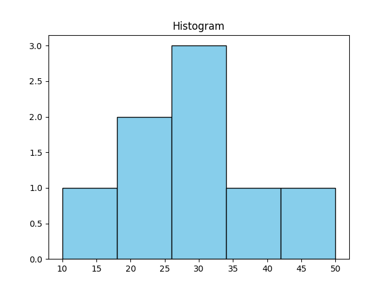

### 2. Bar Chart

- **Definition:** Displays categorical data with rectangular bars whose heights represent values.
- **Use:** To compare quantities across categories.

```python
categories = ['A', 'B', 'C']
values = [10, 20, 15]
plt.bar(categories, values, color='orange')
plt.title("Bar Chart")
plt.show()
```

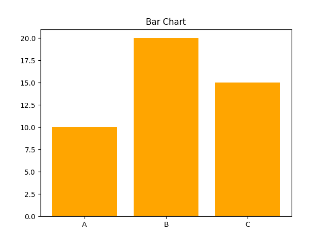

## 3. Line Plot

- **Definition:** Connects data points using lines to show trends over time or sequence.
- **Use:** To show data progression.

```python
x = [1, 2, 3, 4, 5]
y = [10, 15, 13, 18, 20]
plt.plot(x, y, marker='o')
plt.title("Line Plot")
plt.show()
```

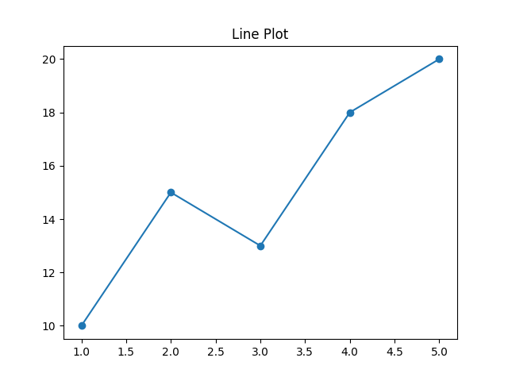

## 4. Scatter Plot

- **Definition:** Shows relationship between two variables using dots.
- **Use:** To identify correlations or patterns.

```python
import seaborn as sns
sns.scatterplot(x=[1,2,3,4,5], y=[5,4,3,2,1])
plt.title("Scatter Plot")
plt.show()
```

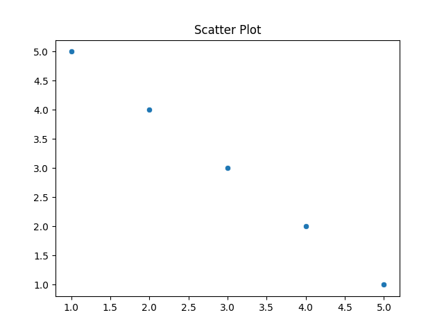

## 5. Stacked Bar Chart

- **Definition:** Bars are divided into segments representing subcategories, stacked on top of each other.
- **Use:** To show part-to-whole relationships.

```python
import numpy as np
labels = ['Q1', 'Q2', 'Q3']
men = [20, 34, 30]
women = [25, 32, 34]
plt.bar(labels, men, label='Men')
plt.bar(labels, women, bottom=men, label='Women')
plt.legend()
plt.title("Stacked Bar Chart")
plt.show()
```

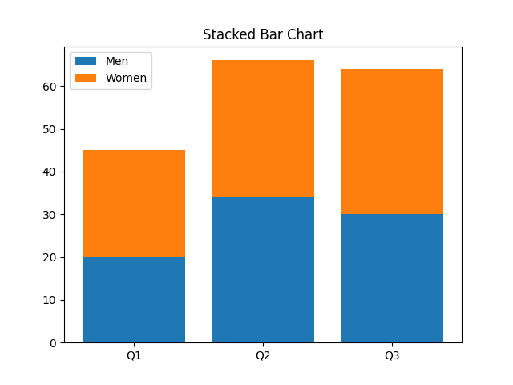

## 6. Clustered Bar Chart (Grouped Bar Chart)

- **Definition:** Groups multiple bars side-by-side for each category.
- **Use:** To compare multiple series across categories.

```python
import numpy as np
labels = ['Q1', 'Q2', 'Q3']
men = [20, 34, 30]
women = [25, 32, 34]
x = np.arange(len(labels))
width = 0.35
plt.bar(x - width/2, men, width, label='Men')
plt.bar(x + width/2, women, width, label='Women')
plt.xticks(x, labels)
plt.legend()
plt.title("Clustered Bar Chart")
plt.show()
```

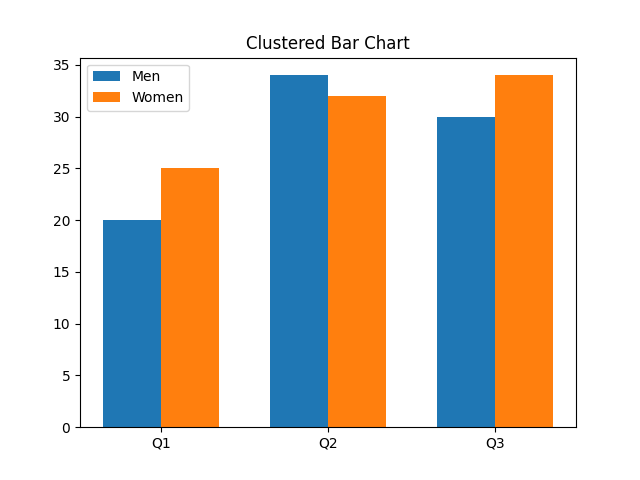

## 7. KDE Plot (Kernel Density Estimate Plot)

- **Definition:** A smooth curve showing the probability density of a continuous variable.
- **Use:** To visualize data distribution more smoothly than a histogram.

```python
sns.kdeplot([1,2,2,3,3,3,4,5], fill=True, color='green')
plt.title("KDE Plot")
plt.show()
```

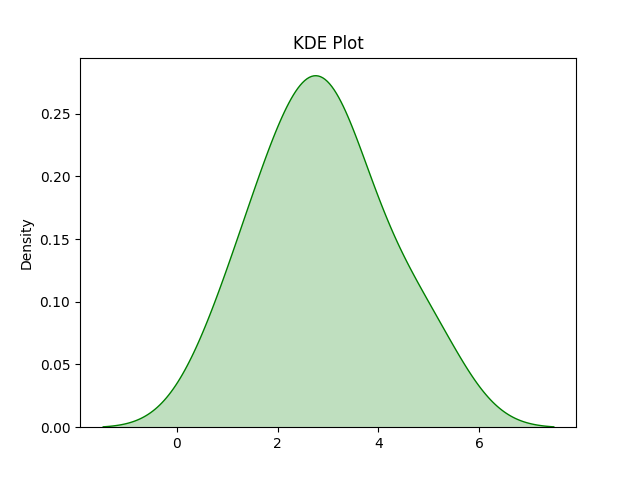

## 8. Box Plot

- **Definition:** Displays data distribution using five-number summary — min, Q1, median, Q3, max.
- **Use:** To detect outliers and data spread.

```python
sns.boxplot(data=[10, 20, 30, 40, 50, 100])
plt.title("Box Plot")
plt.show()
```

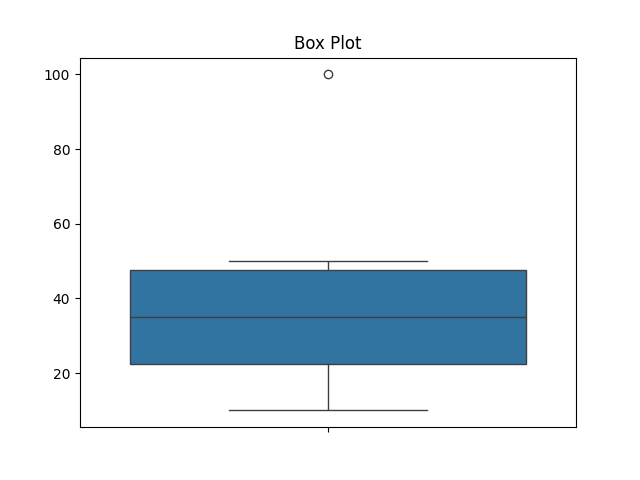

## 9. Violin Plot

- **Definition:** Combines a box plot and KDE plot, showing distribution shape and summary statistics.
- **Use:** To compare distributions across categories.

```python
data = sns.load_dataset("iris")
sns.violinplot(x="species", y="sepal_length", data=data)
plt.title("Violin Plot")
plt.show()
```

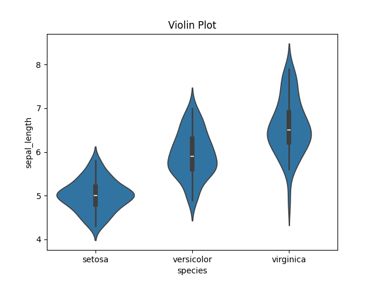

## 10. Pair Plot

- **Definition:** Creates scatter plots between all numeric columns in a dataset.
- **Use:** To see relationships between multiple variables.

```python
data = sns.load_dataset("iris")
sns.pairplot(data, hue="species" )
plt.show()
```

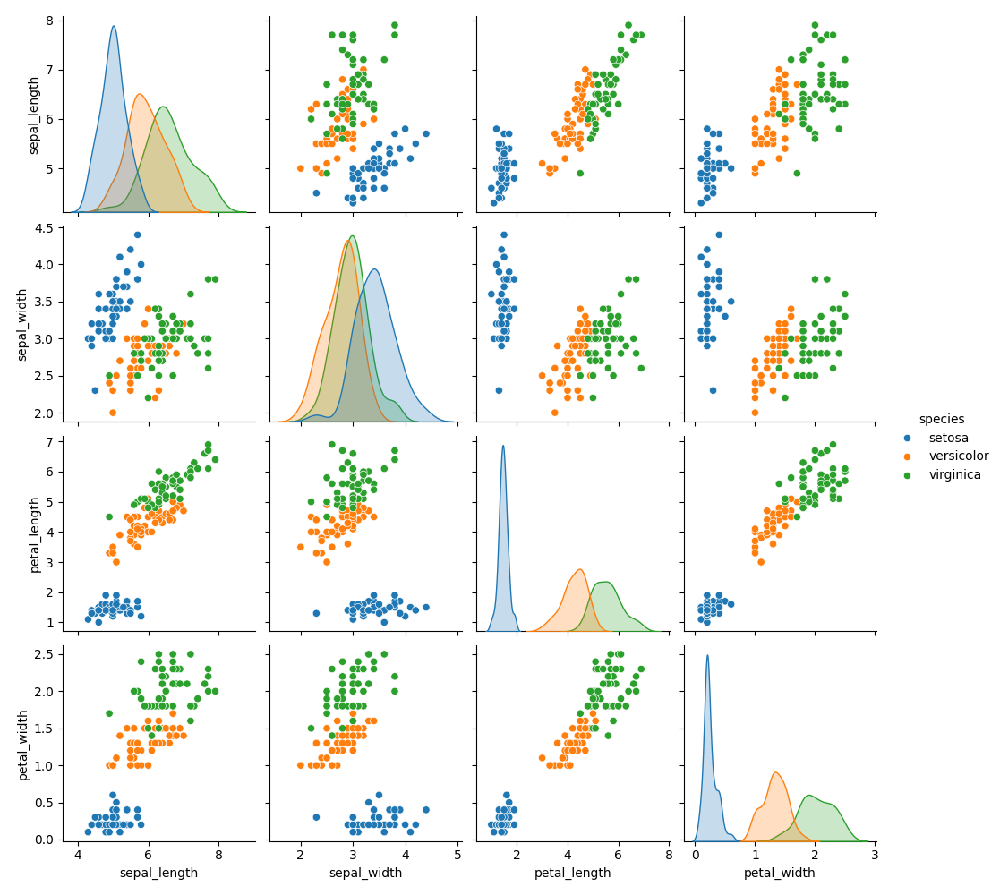

## 11. Subplots

- **Definition:** Allows multiple plots to be shown in a single figure.
- **Use:** To compare multiple visualizations side by side.

```python
fig, axes = plt.subplots(1, 2, figsize=(8, 4))
axes[0].plot([1,2,3], [4,5,6], color='blue')
axes[0].set_title("Line Plot")
axes[1].bar(['A', 'B', 'C'], [3, 5, 7], color='orange')
axes[1].set_title("Bar Chart")
plt.tight_layout()
plt.show()
```

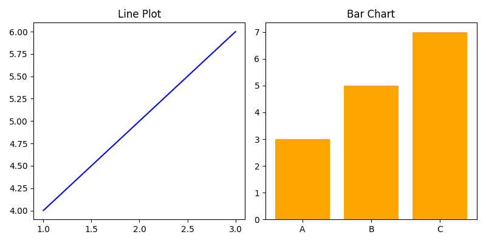
